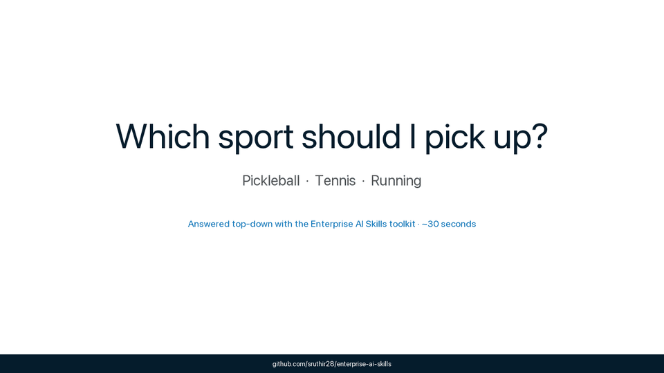
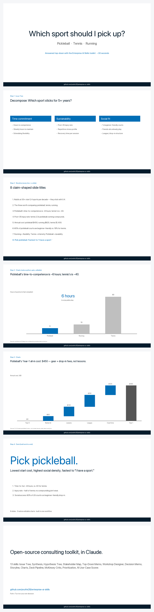
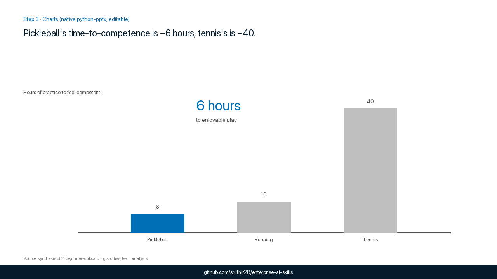

# Enterprise AI Skills

**13 consulting frameworks from a former McKinsey consultant, packaged as drop-in Claude skills.** Issue trees, decision memos, McKinsey-style charts, full deck pipelines — the stuff strategists, PMs, and ops leaders run anyway, now executable in one prompt.



> A 30-second walkthrough: take a real personal question (*"Which sport should I pick up?"*), run it top-down through 4 of the skills — **Issue Tree → Storyline → Charts → Deck Pipeline** — and out comes an 8-slide deck with native editable charts.
>
> Full worked example, including the prompts: [`examples/which-sport-to-pick-up/`](examples/which-sport-to-pick-up/).

<details>
<summary>📖  <b>Prefer to scan at your own pace?</b> Open the storyboard (no autoplay).</summary>



</details>

**Latest update (May 2026):** added Synthesis, Hypothesis Tree, Stakeholder Map, Top-Down Memo, and Workshop Designer; replaced the Gamma-based deck path with native python-pptx + editable charts.

---

## Try it in 30 seconds

Open Claude (or any LLM with these skills loaded) and paste:

```text
Build me a McKinsey-style deck on a decision I'm weighing:
"Which sport should I pick up: pickleball, tennis, or running?"

Run the full top-down workflow:
1. Use issue-tree-builder to decompose into MECE branches
2. Use storyline-builder to turn it into 8 claim-shaped slide titles
3. Use mckinsey-charts for the data slides (bar+callout, waterfall)
4. Use deck-pipeline (strategist → builder → critic → fixer) to produce the final .pptx
```

You'll get the same arc as the GIF above, with a real `.pptx` you can open and edit. Swap the question for one you actually care about: *"Which side project should I commit to?", "Should I take the job?", "Where should we move?"* — same workflow, your decision.

What one of the data slides looks like:



---

## Install

- **Claude Code:** clone this repo — skills auto-load when you work in the directory.
- **Claude.ai:** download the `.skill` file for any skill → Settings → Skills → Add Skill.
- **Any LLM:** copy the contents of `SKILL.md` into your conversation as context.

```bash
git clone https://github.com/sruthir28/enterprise-ai-skills.git
```

No dependencies beyond Claude itself. The deck pipeline (`deck-pipeline` + `mckinsey-charts`) requires Python 3.9+ and `python-pptx` if you want to generate `.pptx` files locally — see [`examples/which-sport-to-pick-up/build.py`](examples/which-sport-to-pick-up/build.py).

---

## Skills

### Thinking
The McKinsey muscle — frame the problem, commit to an answer, pull the "so what" out of messy inputs.

| Skill | What It Does | Best For |
|-------|-------------|----------|
| [SCPR Framework](scpr-framework/SKILL.md) | Structure arguments using Situation-Complication-Problem-Recommendation | Exec summaries, memos, strategic recs |
| [Issue Tree Builder](issue-tree-builder/SKILL.md) | Break down problems into MECE components | Analysis, case prep, work plans |
| [Hypothesis Tree](hypothesis-tree/SKILL.md) | Commit to a Day-1 answer and design tests that could kill it | Start of any analysis where you'd otherwise "boil the ocean" |
| [Synthesis](synthesis/SKILL.md) | Turn a pile of interviews / transcripts / research into 3 insights with evidence + so-what | After customer interviews, surveys, research dumps |
| [Prioritization](prioritization/SKILL.md) | Score features using RICE, Impact/Effort, Value/Complexity | Roadmap decisions, feature trade-offs |
| [AI Use-Case Scorer](ai-use-case-scorer/SKILL.md) | Score AI use cases on Value × Feasibility × Safety; tier them Do Now / Quarter / Park / Avoid | Personal AI roadmap, "what should I AI-ify next" |
| [Data Insights](data-insights-simple/SKILL.md) | Analyze any dataset and answer key questions in plain English | Quick analysis without being a data scientist |

### Writing
Answer-first, evidence-dense, decision-forcing.

| Skill | What It Does | Best For |
|-------|-------------|----------|
| [Decision Memo Builder](decision-memo-builder/SKILL.md) | 1-page memo that forces a yes/no (context → options → rec → risks → ask) | Leadership decisions, scope cuts, buy/build calls |
| [Top-Down Memo](top-down-memo/SKILL.md) | Answer-first writing using the Minto Pyramid — lead, 3 arguments, evidence | Emails to execs, briefing docs, Slack messages that need to land |
| [Storyline Builder](storyline-builder/SKILL.md) | Build slide narratives where each line = a slide title | Decks, pitch presentations, board updates |

### Meetings & People
Where the politics decide the outcome.

| Skill | What It Does | Best For |
|-------|-------------|----------|
| [Meeting Prep Kit](meeting-prep-kit/SKILL.md) | Pre-read + agenda + talking points + objections for any meeting you're driving | Exec reviews, stakeholder pitches, scope negotiations |
| [Stakeholder Map](stakeholder-map/SKILL.md) | Map the room onto Power/Interest with each person's stance + one move | Cross-functional decisions, reorgs, launches |
| [Workshop Designer](workshop-designer/SKILL.md) | Design a half-day or full-day session that ends with a committed artifact + owners | Offsites, leadership alignment, quarterly planning |

### Decks
Native, editable PowerPoint — no Gamma, no images.

| Skill | What It Does | Best For |
|-------|-------------|----------|
| [McKinsey Charts](mckinsey-charts/SKILL.md) | Three workhorse charts (bar+callout, stacked-over-time, waterfall) as native python-pptx objects | Any chart that needs to look EM-reviewed, not Excel-default |
| [Deck Pipeline](deck-pipeline/SKILL.md) | 4-agent pipeline: Strategist → Builder → Critic → Fixer. Uses Storyline + Charts to produce a critique-proof deck. | Board decks, strategy presentations, any high-stakes slides |

### Agents
| Skill | What It Does | Best For |
|-------|-------------|----------|
| [McKinsey Critic](mckinsey-critic/SKILL.md) | Reviews decks and docs like a McKinsey engagement manager — grades, flags problems, gives top 3 fixes | Quality gate before anything goes to stakeholders |

---

## How the skills compose

Most real work uses 2–3 of these together. Some common stacks:

- **Customer research → memo:** Synthesis → Top-Down Memo (or Decision Memo) → McKinsey Critic
- **Strategic question → recommendation:** Issue Tree → Hypothesis Tree → run the tests → Decision Memo
- **Big decision with politics:** Stakeholder Map → Decision Memo → Meeting Prep Kit (for each 1:1)
- **Board deck (the GIF above):** Issue Tree → Storyline Builder → Charts → Deck Pipeline → McKinsey Critic
- **Offsite or alignment workshop:** Workshop Designer → Meeting Prep Kit (pre-1:1s) → workshop runs → Top-Down Memo (post-send)

---

## What this is, and isn't

**Is:** a library of 13 prompts-with-structure that turn a fuzzy strategic ask into a decision-shaped artifact. Each skill encodes a specific consulting move (MECE decomposition, Day-1 hypothesis, pyramid principle, etc.) so Claude doesn't reinvent the structure every time.

**Isn't:** a chatbot, a UI, or generic "AI for work" prompts. There's no model fine-tuning. The skills work because the structure is right, not because the model is special.

---

## Need this adapted for your team?

Domain-specific versions, custom workflows, AI rollouts — reach out: [sru281+build@gmail.com](mailto:sru281+build@gmail.com).

---

MIT licensed. Built by [Sruthi Chintakunta](https://www.linkedin.com/in/sruthichintakunta/).
